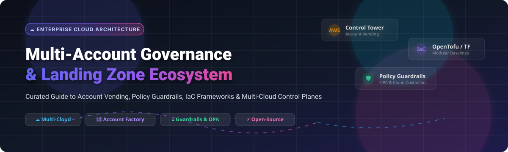

# 🌐 Awesome Multi-Account Governance & Landing Zone Ecosystem 🚀

<div align="center">

<a href="https://github.com/ishandutta2007/Awesome-Awesome-Awesome"></a>
<a href="https://discord.gg/jc4xtF58Ve"></a>
<a href="https://github.com/ishandutta2007/Awesome-Multi-Account-Governance-Landing-Zone/stargazers"></a>
<a href="https://github.com/ishandutta2007/Awesome-Multi-Account-Governance-Landing-Zone/network/members"></a>
<a href="https://github.com/ishandutta2007/Awesome-Multi-Account-Governance-Landing-Zone/blob/main/LICENSE"></a>
<a href="https://github.com/ishandutta2007"></a>

</div>

---

## 📌 Executive Summary & Meta Overview

A curated directory of **Commercial SaaS Platforms** and **Open-Source GitHub Repositories** dedicated to **Multi-Account Governance, Cloud Landing Zone Automation, Policy-as-Code Guardrails, and Account Vending Frameworks** across AWS, Microsoft Azure, Google Cloud (GCP), and Multi-Cloud environments.

This catalog helps **Cloud Architects, DevOps Leads, and Platform Engineers** evaluate enterprise governance suites, Terraform/OpenTofu orchestration engines, compliance auditing tools, and GitOps control planes.

---

## 📊 Market Dynamics & Industry Insights

> 💡 **Market Size & Growth Trend**: The global **Cloud Governance & Landing Zone Management Market** was valued at approximately **$2.4 Billion in 2024** and is projected to expand to **$7.8 Billion by 2030**, reflecting a Compound Annual Growth Rate (**CAGR**) of **~21.5%**.
>
> 🧩 **Market Fragmentation Index**: The market is **moderately fragmented**. Primary cloud hyper-scalers (*AWS, Microsoft Azure, Google Cloud*) anchor native account factory baselines and landing zone blueprints. Meanwhile, specialized IaC management platforms (*Terraform Cloud, Spacelift*) and cloud-native governance suites (*Turbot, CoreStack, Meshcloud*) compete strongly for multi-cloud enterprise sovereignty, preventing a single "winner-take-all" monopoly.

---

## 📑 Table of Contents

- [🏢 SaaS & Hosted Commercial Platforms](#-saas--hosted-commercial-platforms)
- [⚡ Open-Source GitHub Repositories](#-open-source-github-repositories)
- [🧩 Architecture Patterns & Integration Blueprints](#-architecture-patterns--integration-blueprints)
- [🤝 How to Contribute](#-how-to-contribute)
- [⚠️ Enterprise Disclaimer](#%EF%B8%8F-enterprise-disclaimer)
- [📈 Star History](#-star-history)
- [💖 Support & Sponsorship](#-support--sponsorship)

---

## 🏢 SaaS & Hosted Commercial Platforms

Below is the comparative analysis of top commercial multi-account governance platforms, ordered by **Company Size & Valuation (Descending)**:

| 🏢 Platform / Product | 💼 Company Size & Valuation | 💰 Starting Tier Pricing | 🎁 Free Tier & Trial Limits | 🎯 Key Focus & Features |
| :--- | :--- | :--- | :--- | :--- |
| **[Azure Landing Zones](https://azure.microsoft.com/en-us/solutions/cloud-scale-analytics/)** | **$3.0 Trillion** Valuation (~$245B Annual Rev) | **$0.10** / policy evaluation/month *(Blueprints free; pay for Azure Policy & Log Analytics)* | **$200 free credit** for 30 days + **5 GB/month** Log Analytics ingestion free forever | Enterprise-scale Azure subscription hierarchy, management groups, policy-driven guardrails & hub-spoke networking. |
| **[Google Cloud Landing Zone](https://cloud.google.com/architecture/landing-zones)** | **$2.0 Trillion** Valuation (~$307B Annual Rev) | **$25.00** / node/month for SCC Premium *(Framework free; pay for GCP Monitoring/Logging)* | **$300 free credits** for 90 days + **50 GiB/month** Cloud Logging free forever | Hierarchical GCP organization structure, folder trees, VPC service controls, and automated project provisioning. |
| **[AWS Control Tower](https://aws.amazon.com/controltower/)** | **$1.8 Trillion** Valuation (~$90B AWS Annual Rev) | **$0.003** / AWS Config rule eval *(Control Tower setup free; pay for AWS Config/CloudTrail/S3)* | **1,200 AWS Config** rule evals/month free + CloudTrail 1st copy of management events free forever | Automated multi-account AWS landing zone, Account Factory provisioning, baseline guardrails, and central dashboard. |
| **[Terraform Cloud](https://www.terraform.io/cloud)** | **$6.4 Billion** Valuation *(Acquired by IBM)* | **$0.00014** / managed resource/hour (~$0.10/resource/mo) or **$20** / user/month | **Free forever** for up to **500 managed resources** per month | HashiCorp's managed IaC platform featuring remote state management, Sentinel policy enforcement, and drift detection. |
| **[Spacelift](https://spacelift.io/)** | **$100M+** Valuation *(Series B VC Funded)* | **$250.00** / month *(Starter Tier with 2,000 public concurrency minutes)* | **Free forever tier** for up to **2 users & 1 concurrency** + 14-day full feature trial | Specialized IaC orchestration platform supporting Terraform, OpenTofu, Pulumi, CloudFormation, and OPA guardrails. |
| **[CoreStack](https://www.corestack.io/)** | **$80M - $100M** Valuation *(Series A/B VC Funded)* | **$49.00** / managed node/month *(Graphion / FinOps Bronze Tier)* | **30-day free trial** supporting up to **10 cloud accounts** & assessment tokens | AI-powered multi-cloud governance platform delivering continuous compliance, SecOps, and FinOps automation. |
| **[Turbot Guardrails](https://turbot.com/)** | **$20M - $30M** Valuation (~$10M ARR) | **$0.05** / active control/month *(SaaS)* or **$0.10** / active control/month *(Self-Hosted)* | **14-day free trial** supporting up to **500 managed cloud resources** | Real-time enterprise multi-cloud policy enforcement, hierarchical guardrails, and cross-account access governance. |
| **[Gruntwork Pipelines](https://gruntwork.io/)** | **$15M - $25M** Valuation (~$5M - $10M ARR) | **$990.00** / month *(Growth Plan with IaC Library & Pipelines)* | **Free tier** for Terragrunt Scale + **14-day trial** for Gruntwork Pipelines | Production-grade Terraform & Terragrunt landing zone modules, automated account vending, and CI/CD pipelines. |
| **[StackZone](https://stackzone.com/)** | **$10M - $15M** Valuation (~$2M - $5M ARR) | **$249.00** / month *(Starter Platform Plan)* | **14-day free trial** supporting **1 AWS Organization & up to 5 accounts** | Automated AWS landing zone management platform with pre-configured compliance rules, cost controls, and security baselines. |
| **[Meshcloud](https://meshcloud.io/)** | **$10M - $15M** Valuation (~$3M ARR) | **€750.00** / month (~$820/mo for meshStack Cloud Foundation) | **14-day live sandbox environment** & guided proof-of-concept trial | Enterprise cloud foundation platform enabling self-service cloud account tenant vending with multi-cloud governance. |

---

## ⚡ Open-Source GitHub Repositories

Below are the top open-source projects for self-hosted landing zones, account factory automation, policy-as-code, and cloud control planes, sorted by **GitHub Star Count (Descending)**:

1. **[Ansible](https://github.com/ansible/ansible)** [](https://github.com/ansible/ansible/stargazers)  
   **Radically simple IT automation engine** — Orchestrates configuration management, multi-account system provisioning, and hybrid cloud landing zone operational tasks. `GPL-3.0`

2. **[Terraform](https://github.com/hashicorp/terraform)** [](https://github.com/hashicorp/terraform/stargazers)  
   **The industry-standard Infrastructure as Code tool** — Enables declarative infrastructure definition across AWS, Azure, GCP, and custom providers. `BSL-1.1`

3. **[Trivy](https://github.com/aquasecurity/trivy)** [](https://github.com/aquasecurity/trivy/stargazers)  
   **Comprehensive security scanner** — Audits IaC files (Terraform, CloudFormation, Bicep), container images, and cloud account misconfigurations across landing zones. `Apache-2.0`

4. **[OpenTofu](https://github.com/opentofu/opentofu)** [](https://github.com/opentofu/opentofu/stargazers)  
   **Community-driven open-source Terraform fork** — Governed by Linux Foundation, providing modular IaC execution without commercial license restrictions. `MPL-2.0`

5. **[Pulumi](https://github.com/pulumi/pulumi)** [](https://github.com/pulumi/pulumi/stargazers)  
   **Developer-centric Infrastructure as Code** — Provisions multi-account infrastructure using real programming languages including TypeScript, Python, Go, and C#. `Apache-2.0`

6. **[Prowler](https://github.com/prowler-cloud/prowler)** [](https://github.com/prowler-cloud/prowler/stargazers)  
   **Open-source cloud security assessment tool** — Conducts security audits, CIS benchmarks, and compliance framework verification across AWS, Azure, and GCP accounts. `Apache-2.0`

7. **[Infracost](https://github.com/infracost/infracost)** [](https://github.com/infracost/infracost/stargazers)  
   **Cloud cost estimation for IaC** — Calculates real-time cost impact directly inside Terraform and OpenTofu pull requests across multi-account environments. `Apache-2.0`

8. **[Open Policy Agent (OPA)](https://github.com/open-policy-agent/opa)** [](https://github.com/open-policy-agent/opa/stargazers)  
   **General-purpose policy engine** — Enforces policy-as-code guardrails, authorization checks, and compliance rules across cloud infrastructure and Kubernetes. `Apache-2.0`

9. **[Crossplane](https://github.com/crossplane/crossplane)** [](https://github.com/crossplane/crossplane/stargazers)  
   **CNCF Cloud-Native Control Plane** — Extends Kubernetes API with Custom Resource Definitions (CRDs) to build custom cloud account control planes. `Apache-2.0`

10. **[Terragrunt](https://github.com/gruntwork-io/terragrunt)** [](https://github.com/gruntwork-io/terragrunt/stargazers)  
    **DRY Terraform orchestration tool** — Keeps multi-account Terraform configurations maintainable, orchestrates module dependencies, and handles remote state backends. `MIT`

11. **[Atlantis](https://github.com/runatlantis/atlantis)** [](https://github.com/runatlantis/atlantis/stargazers)  
    **Terraform pull request automation engine** — Enables GitOps collaboration, automated `terraform plan` execution, and locked applies inside pull requests. `Apache-2.0`

12. **[Checkov](https://github.com/bridgecrewio/checkov)** [](https://github.com/bridgecrewio/checkov/stargazers)  
    **Static code analysis tool for IaC** — Scans Terraform, CloudFormation, Helm, and ARM templates for security vulnerabilities and compliance drift. `Apache-2.0`

13. **[Kyverno](https://github.com/kyverno/kyverno)** [](https://github.com/kyverno/kyverno/stargazers)  
    **Kubernetes-native policy management** — Validates, mutates, and generates Kubernetes resource configurations for cloud platform control planes. `Apache-2.0`

14. **[Steampipe](https://github.com/turbot/steampipe)** [](https://github.com/turbot/steampipe/stargazers)  
    **Zero-ETL SQL engine for cloud infrastructure** — Queries AWS, Azure, GCP, and GitHub resources using standard SQL queries across multiple accounts. `AGPL-3.0`

15. **[CloudQuery](https://github.com/cloudquery/cloudquery)** [](https://github.com/cloudquery/cloudquery/stargazers)  
    **High-performance cloud asset inventory pipeline** — Extracts cloud configuration metadata into PostgreSQL or Snowflake databases for multi-account governance. `MPL-2.0`

16. **[Cloud Custodian](https://github.com/cloud-custodian/cloud-custodian)** [](https://github.com/cloud-custodian/cloud-custodian/stargazers)  
    **Stateless rules engine for cloud management** — Enforces real-time security policies, tag compliance, and automatic resource remediation across AWS, Azure, GCP. `Apache-2.0`

17. **[Digger](https://github.com/diggerhq/digger)** [](https://github.com/diggerhq/digger/stargazers)  
    **Open-source Terraform Cloud alternative** — Executes IaC plans and applies natively within existing CI/CD pipelines such as GitHub Actions and GitLab CI. `MIT`

18. **[Gatekeeper](https://github.com/open-policy-agent/gatekeeper)** [](https://github.com/open-policy-agent/gatekeeper/stargazers)  
    **OPA-based policy controller for Kubernetes** — Enforces organizational constraints, admission control checks, and custom policy definitions. `Apache-2.0`

19. **[Terramate](https://github.com/terramate-io/terramate)** [](https://github.com/terramate-io/terramate/stargazers)  
    **IaC stack orchestrator and code generator** — Manages large multi-account Terraform/OpenTofu codebases with change detection and parallel execution. `MPL-2.0`

20. **[Google Cloud Foundation Toolkit](https://github.com/GoogleCloudPlatform/cloud-foundation-toolkit)** [](https://github.com/GoogleCloudPlatform/cloud-foundation-toolkit/stargazers)  
    **Google official GCP landing zone modules** — Standardizes organization structures, folder hierarchies, networking baselines, and project factory automation. `Apache-2.0`

21. **[Azure Landing Zones (ALZ) Terraform](https://github.com/Azure/terraform-azurerm-caf-enterprise-scale)** [](https://github.com/Azure/terraform-azurerm-caf-enterprise-scale/stargazers)  
    **Microsoft official Enterprise-Scale Azure Landing Zone module** — Provisions Azure Management Groups, subscription landing zones, and core networking policies. `MIT`

22. **[Azure Service Operator](https://github.com/Azure/azure-service-operator)** [](https://github.com/Azure/azure-service-operator/stargazers)  
    **Azure-native Kubernetes controller** — Provisions and manages Azure cloud resources directly using Kubernetes manifests and GitOps workflows. `MIT`

23. **[AWS Control Tower Account Factory for Terraform (AFT)](https://github.com/aws-ia/terraform-aws-control_tower_account_factory)** [](https://github.com/aws-ia/terraform-aws-control_tower_account_factory/stargazers)  
    **AWS official Terraform account factory framework** — Automates creation and post-provisioning customization of AWS accounts integrated with AWS Control Tower. `Apache-2.0`

24. **[Superwerker](https://github.com/superwerker/superwerker)** [](https://github.com/superwerker/superwerker/stargazers)  
    **Automated AWS multi-account setup** — Configures AWS Control Tower, Security Hub, GuardDuty, and backup baselines using CloudFormation templates. `MIT`

---

## 🧩 Architecture Patterns & Integration Blueprints

Designing an enterprise cloud landing zone requires balancing **account isolation, identity federation, network routing, and security guardrails**:

```
                              ┌───────────────────────────────────────┐
                              │     Cloud Organization Root / Org     │
                              └───────────────────┬───────────────────┘
                                                  │
             ┌────────────────────────────────────┼────────────────────────────────────┐
             ▼                                    ▼                                    ▼
┌─────────────────────────┐          ┌─────────────────────────┐          ┌─────────────────────────┐
│   Core Security OU      │          │   Infrastructure OU     │          │    Workload / App OU    │
├─────────────────────────┤          ├─────────────────────────┤          ├─────────────────────────┤
│ • Log Archive Account   │          │ • Shared Network (Hub)  │          │ • Development Account   │
│ • Security Tooling Acc  │          │ • Shared Services Acc   │          │ • Staging Account       │
│ • Audit & GuardDuty     │          │ • DNS & Egress Firewalls│          │ • Production Account    │
└─────────────────────────┘          └─────────────────────────┘          └─────────────────────────┘
```

### 🛠️ Recommended Tech Stack Combos:
- **AWS Sovereign Landing Zone**: AWS Control Tower + AWS AFT (`terraform-aws-control_tower_account_factory`) + Terragrunt + Cloud Custodian.
- **Azure Enterprise Landing Zone**: Azure ALZ Terraform (`terraform-azurerm-caf-enterprise-scale`) + Atlantis + Open Policy Agent.
- **Multi-Cloud Kubernetes Platform**: Crossplane + OpenTofu + Kyverno + Trivy + Prowler.

---

## 🤝 How to Contribute

Contributions are warmly welcome! Please follow these simple guidelines:

1. Fork this repository to your own GitHub account.
2. Create a descriptive branch (`git checkout -b add-new-tool`).
3. Add your entry to either the **SaaS Table** or **Open-Source List** preserving the established format and sorting order.
4. Ensure descriptions are objective, factual, and include official documentation links.
5. Open a Pull Request with a short summary of the addition.

*Refer to the curated list guide on [Awesome-Awesome-Awesome](https://github.com/ishandutta2007/Awesome-Awesome-Awesome) for quality benchmarks.*

---

## ⚠️ Enterprise Disclaimer

- This repository is a **community-curated index** provided for educational and architectural evaluation purposes.
- Landing zone automation handles sensitive IAM permissions and core infrastructure. Always conduct thorough security testing in non-production sandboxes before deploying to enterprise environments.
- Verify licensing terms (`Apache-2.0`, `MIT`, `MPL-2.0`, `BSL-1.1`, `GPL-3.0`) against your organization's legal policies before incorporating open-source modules into commercial products.

---

## 📈 Star History

[](https://star-history.dera.page/#ishandutta2007/Awesome-Multi-Account-Governance-Landing-Zone&type=date&legend=top-left)

---

## 💖 Support & Sponsorship

If you found this curated list helpful for your platform engineering, cloud architecture, or multi-account governance journey, please consider supporting the project:

- 🌟 **Star this repository** to improve its visibility for other engineers.
- 🔀 **Fork & Share** it with your DevOps community and colleagues.
- ☕ **Buy me a coffee / Sponsor**: Support ongoing maintenance and cloud research via the [GitHub Sponsor Dashboard](https://github.com/sponsors/ishandutta2007).

*Thank you for supporting open-source cloud governance!*
